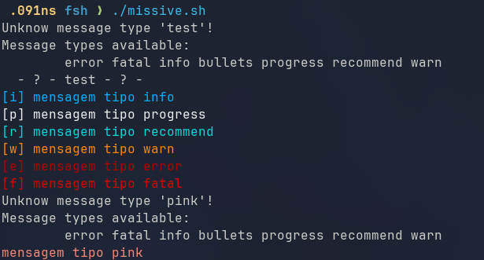

# Poshfier

Poshfying messages :D . Inspired by the __fancy_message__ function in [flexiondotorg's \(Martin Wimpress\)](https://github.com/flexiondotorg) [deb-get](https://github.com/wimpysworld/deb-get)



## Use it
### Clone the repo

```bash
git clone github.com/msmafra/poshfier
cd poshfier
chmod +x poshfier
```
### Test it
```bash
chmod +x missive.sh
```

### Or download only it
```bash
curl -sL# -OC - "https://raw.githubusercontent.com/msmafra/poshfier/refs/heads/main/poshfier.bash"
```

### Add it to your script
```bash
#!/usr/bin/env bash
source  poshfier.bash
msg() {
    poshfier "${@}"
}

msg error "Something went wrong!"
```
## Enable other colored messages
To enable other colors you can add to the __message_types__ array.

## Or add more

Visit:
- [Linmiao Xu's Robotmoon website](https://robotmoon.com/256-colors/)
- [Or Color Hex](https://www.color-hex.com/color-names.html)
